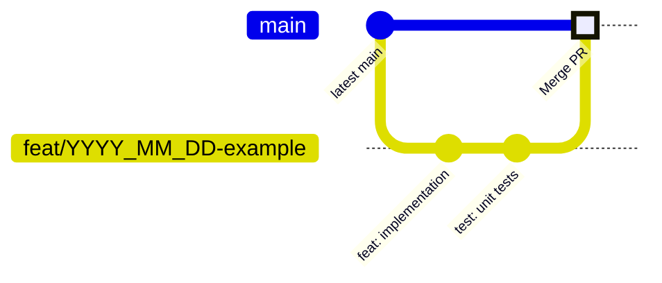
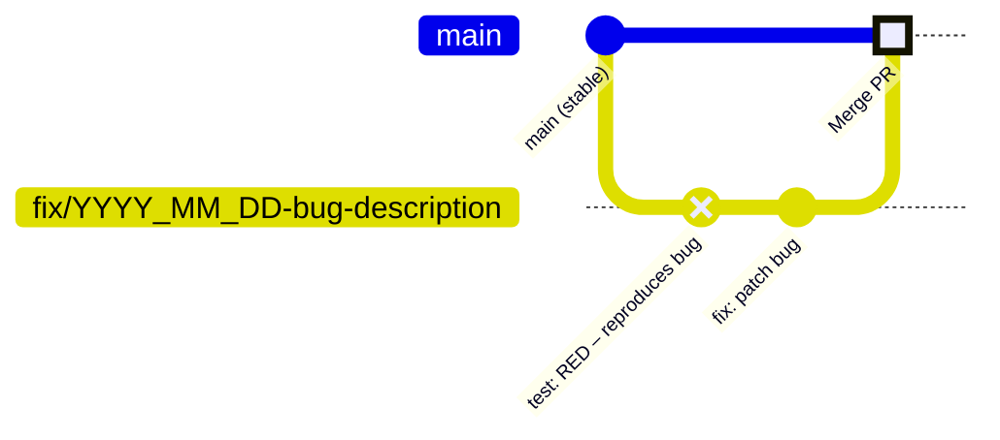
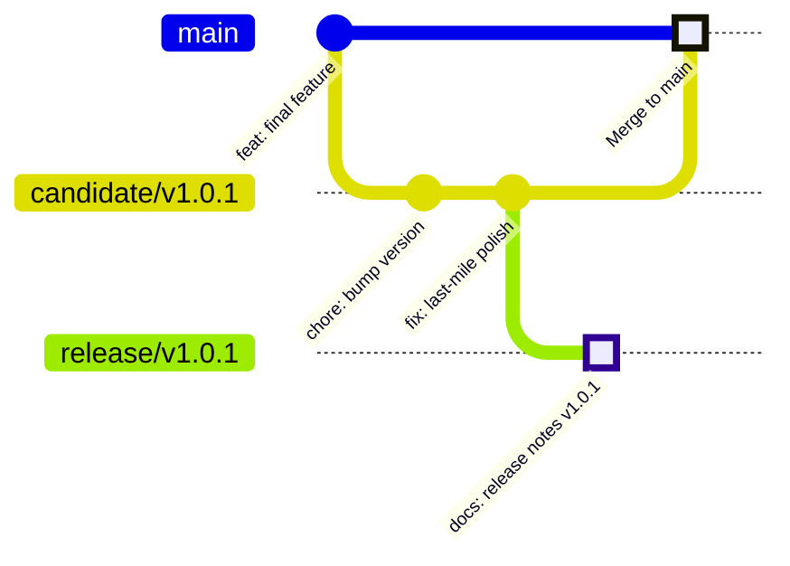
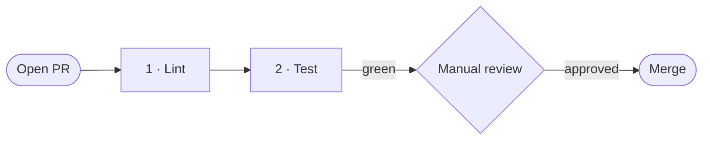

# Git Workflow
## llm_gateway

**Version:** 1.0
**Date:** 2026-04-02
**Status:** Active

---

## Table of Contents

1. [Overview](#1-overview)
2. [Branch Strategy](#2-branch-strategy)
   - 2.1 [Permanent Branches](#21-permanent-branches)
   - 2.2 [Working Branches](#22-working-branches)
   - 2.3 [Naming Convention](#23-naming-convention)
3. [Commit Messages](#3-commit-messages)
4. [Workflow Flows](#4-workflow-flows)
   - 4.1 [Feature Flow](#41-feature-flow)
   - 4.2 [Bug Fix Flow](#42-bug-fix-flow)
   - 4.3 [Release Flow](#43-release-flow)
5. [Merge Gate](#5-merge-gate)
6. [Versioning (SemVer)](#6-versioning-semver)
7. [Stale Branch Policy](#7-stale-branch-policy)
8. [Testing Discipline](#8-testing-discipline)

---

## 1. Overview

llm_gateway uses a **trunk-based** workflow with short-lived working branches. All production code lives on `main`; every change flows through a pull request (PR) guarded by CI.

No long-lived `develop` or `staging` branches are used. All integration happens directly on `main` via PR.

---

## 2. Branch Strategy

### 2.1 Permanent Branches

| Branch | Role | Direct push |
|--------|------|-------------|
| `main` | Production-ready, always releasable | ❌ Never |
| `candidate/vMAJOR.MINOR.PATCH` | Release stabilisation; branches from `main` | ❌ Never |
| `release/vMAJOR.MINOR.PATCH` | Frozen release archive; never modified after creation | ❌ After creation |

Examples: `candidate/v1.0.1`, `release/v1.0.1`

### 2.2 Working Branches

| Prefix | Purpose | Example |
|--------|---------|---------|
| `feat/` | New user-facing feature | `feat/2026_04_05-tools-streaming` |
| `fix/` | Bug fix | `fix/2026_04_03-ollama-tool-id-missing` |
| `refactor/` | Internal restructure (no behaviour change) | `refactor/2026_04_10-split-cli-gateway` |
| `test/` | Test additions or updates | `test/2026_04_05-add-tools-integration` |
| `docs/` | Documentation only | `docs/2026_04_02-llm-interfaces-spec` |
| `chore/` | Dependency bump, toolchain update | `chore/2026_04_01-bump-litellm` |
| `ci/` | CI/CD pipeline changes | `ci/2026_04_02-add-format-check` |

### 2.3 Naming Convention

```
<type>/YYYY_MM_DD-<short-description>
```

Rules:
- **type** — one of the prefixes above (lower-case)
- **YYYY_MM_DD** — ISO date the branch was created
- **short-description** — lowercase words separated by hyphens; no spaces

---

## 3. Commit Messages

Commits follow a simplified [Conventional Commits](https://www.conventionalcommits.org/) style:

```
<type>[optional scope]: <description>
```

| Type | When to use |
|------|-------------|
| `feat` | Introduces a new feature |
| `fix` | Patches a bug |
| `refactor` | Code change with no behaviour change |
| `test` | Adds or changes tests |
| `docs` | Documentation only |
| `chore` | Maintenance, dependency upgrade |
| `ci` | CI pipeline configuration |

Scope (optional) narrows the area of change — e.g. `fix(ollama):`, `feat(tools):`.

Examples:
```
feat(tools): add OllamaToolsLLM and LiteLLMToolsLLM implementations
fix(cli): guard against missing session_id in stream-json output
refactor: move impl files into src/impl/ subpackage
ci: add ruff format check to lint job
```

---

## 4. Workflow Flows

### 4.1 Feature Flow

Branch from `main`, develop in focused commits, then open a PR back to `main`. Implementation and tests must be in **separate commits**; the test commit must be reviewable on its own (see [§8 Testing Discipline](#8-testing-discipline)).



**Steps:** branch from latest `main` → implement → add test commit(s) → push → open PR → CI must pass → review → merge.

### 4.2 Bug Fix Flow

Bug fixes follow the same PR-gated flow but must apply the **Red → Green** idiom: the failing test is committed first (CI goes red), then the fix is committed (CI goes green).



**Steps:** branch → commit failing test (red) → commit fix (green) → push → open PR → CI must pass → review → merge.

### 4.3 Release Flow



**Steps:**
1. Branch `candidate/vMAJOR.MINOR.PATCH` from `main`.
2. Stabilise — commit only critical fixes and version bumps via PRs.
3. Branch `release/vMAJOR.MINOR.PATCH` from candidate tip; add release notes as the final commit. **Frozen forever.**
4. Open PR from `candidate` → `main`; CI must pass; merge and tag with `ver-MAJOR.MINOR.PATCH`.

---

## 5. Merge Gate

Every change to `main` must be submitted as a **Pull Request**. A PR may not be merged until:

1. **CI passes** — all jobs are green
2. **Manual checks** pass:
   - PR description clearly states what changed and why
   - No unresolved review comments
   - Branch is not in draft / WIP state

### CI Jobs

| # | Job | What it runs |
|---|-----|--------------|
| 1 | **Lint** | `ruff check src/ tests/` + `ruff format --check src/ tests/` |
| 2 | **Test** | `pytest tests/ -m "not integration" --cov=src --cov-fail-under=85` |

Job 2 runs after job 1 passes.



---

## 6. Versioning (SemVer)

Releases are tagged on `main` using the form:

```
ver-<MAJOR>.<MINOR>.<PATCH>
```

| Segment | Increment when |
|---------|----------------|
| **MAJOR** | Breaking API or interface change |
| **MINOR** | New capability (new LLM type, new backend) |
| **PATCH** | Bug fix or non-functional improvement |

---

## 7. Stale Branch Policy

- Working branches are **kept** after their PR is merged — the date in the name provides a permanent audit trail.
- Branches untouched for **30+ days** without an open PR are considered stale and may be removed.
- Force-push to `main` is **prohibited**.

---

## 8. Testing Discipline

### Features

Every feature branch must include one or more **dedicated test commit(s)** covering the new behaviour, committed separately from the implementation.

```
feat(tools): add OllamaToolsLLM implementation     ← implementation
test(tools): add happy path and payload tests       ← separate test commit
```

### Bug Fixes — Red → Green

1. **Red commit** — add a test that reproduces the bug and **fails** on CI.
2. **Green commit** — apply the fix; the same test now passes.

```
test: RED – tool id missing when Ollama omits it    ← fails CI
fix(ollama): generate id when tool_call has no id   ← test goes green
```

This ensures the test genuinely catches the regression and prevents silent reappearance.
