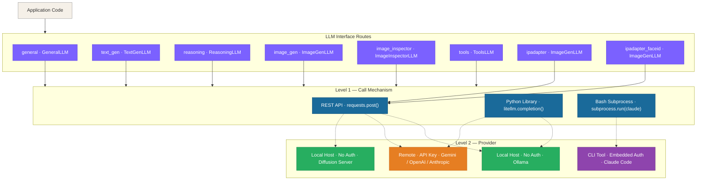

# LLM Interfaces — Abstraction Design

**Project**: llm_gateway — standalone LLM routing library and local HTTP gateway
**Date**: 2026-04-08
**Version**: 0.2.0

---

## Table of Contents

1. [Overview](#1-overview)
2. [The 8 Interface Routes](#2-the-8-interface-routes)
3. [The Two Levels of Abstraction](#3-the-two-levels-of-abstraction)
4. [Interface Type Contracts](#4-interface-type-contracts)
5. [Built-in Validation and Retry](#5-built-in-validation-and-retry)
6. [Capability Matrix](#6-capability-matrix)
7. [Implementation Details](#7-implementation-details)
8. [Architecture Call-Flow Diagram](#8-architecture-call-flow-diagram)
9. [Configuration and Selection](#9-configuration-and-selection)

---

## 1. Overview

The gateway routes LLM calls across 6 typed task categories. Each has its own
input/output contract, preferred model characteristics, and tuning knobs.

Three execution backends are supported:
**Local** (Ollama REST API), **API-Key** (LiteLLM Python library), and **CLI** (Claude Code subprocess).

This document defines the **two-level abstraction** that isolates application code from both
the **call mechanism (Level 1)** and the **provider specifics (Level 2)**.

---

## 2. The 8 Interface Routes

| # | Route | Abstract type | Task character |
|---|-------|--------------|----------------|
| 1 | **general** | `GeneralLLM` | Open-ended text — chat, summarisation, free-form responses |
| 2 | **text_gen** | `TextGenLLM` | Structured text generation — output must match a schema (YAML, JSON, template) |
| 3 | **reasoning** | `ReasoningLLM` | Multi-step analytical thinking — chains of logic, comparison, decision-making |
| 4 | **image_gen** | `ImageGenLLM` | Prompt → PNG — diffusion/generative image models |
| 5 | **image_inspector** | `ImageInspectorLLM` | PNG → text — vision models that analyse, classify, or describe an image |
| 6 | **tools** | `ToolsLLM` | Function / tool calling — model returns structured tool invocations |
| 7 | **ipadapter** | `ImageGenLLM` | Reference-image-conditioned generation — IP-Adapter style transfer |
| 8 | **ipadapter_faceid** | `ImageGenLLM` | Face-conditioned generation — IP-Adapter FaceID portrait synthesis |

Routes 7 and 8 share the `ImageGenLLM` abstract type and `ImageResponse` output.  They differ only in their `implementation` (`diffusion_server`) and the diffusion endpoint they target (`/ipadapter` vs `/ipadapter_faceid`).  Application code that calls `factory.ipadapter()` or `factory.ipadapter_faceid()` receives a plain `ImageGenLLM` — no special types required.

### Why keep overlapping routes separate?

Routes 1, 2, 3, and 6 all operate on messages but differ in:

| Dimension | General | Text-gen | Reasoning | Tools |
|-----------|---------|----------|-----------|-------|
| Ideal model | Balanced, conversational | Instruction-following, structured | Thinking/reasoning | Tool-use capable |
| Typical temperature | 0.8 | 0.3 | 0.1 | 0.5 |
| Max tokens | Medium (2 048) | Short (512) | Long (4 096+) | Medium (2 048) |
| Built-in retry | No | Yes — schema-validate | No | No |
| Output shape | `TextResponse` | `TextResponse` | `TextResponse` | `ToolCallResponse` |

---

## 3. The Two Levels of Abstraction



### Level 1 — Call Mechanism

| Mechanism | Description | Reaches |
|-----------|-------------|---------|
| **REST API** | `requests.post()` to an HTTP endpoint | Local or remote |
| **Python library** | `litellm.completion()` in-process | Local or remote |
| **Bash subprocess** | `subprocess.run(["claude", ...])` | CLI-managed provider only |

### Level 2 — Provider

| Provider | Examples | API key | Notes |
|----------|---------|:-------:|-------|
| **Local** | Ollama | ❌ | REST or LiteLLM with `api_base` |
| **Remote** | Gemini, OpenAI, Anthropic | ✅ | LiteLLM reads env vars automatically |
| **CLI-managed** | Claude Code | ❌ in code | Auth stored in `~/.claude/` |

---

## 4. Interface Type Contracts

### Message role support

| Type | `system` | `user` | `assistant` |
|------|:--------:|:------:|:-----------:|
| **General** | ✅ | ✅ | ✅ |
| **Text-gen** | ✅ | ✅ | ✅ |
| **Reasoning** | ✅ | ✅ | ✅ |
| **Image-gen** | ❌ | ✅ | ❌ |
| **Image Inspector** | ✅ | ✅ | ❌ |
| **Tools** | ✅ | ✅ | ✅ |

### Response shapes

```
TextResponse     { content: str,        model: str, duration_ms: float, attempts: int, last_error: str|None }
ImageResponse    { image: bytes,         model: str, duration_ms: float, attempts: int, last_error: str|None }
ToolCallResponse { content: str|None,    model: str, duration_ms: float, attempts: int, last_error: str|None,
                   tool_calls: list[ToolCall] }
ToolCall         { id: str, name: str, arguments: dict }
```

- `attempts` — number of LLM calls made (1 = succeeded first try)
- `last_error` — error from the final failed attempt, `None` on success
- `ToolCallResponse.content` — optional text the model returned alongside the tool calls (may be `None`)

---

### 4.1 General

**Purpose**: Open-ended conversational or free-form text. No strict output schema.

| Field | Type | Default | Description |
|-------|------|---------|-------------|
| `messages` | `list[dict]` | — | System + user (+ optional assistant) turns |
| `temperature` | `float` | backend default | Conversational, varied |
| `max_tokens` | `int` | backend default | |
| `timeout` | `int` | `60 s` | |

**Output**: `TextResponse`

---

### 4.2 Text-gen

**Purpose**: Structured text generation — output must conform to a caller-specified schema.

| Field | Type | Default | Description |
|-------|------|---------|-------------|
| `messages` | `list[dict]` | — | System specifies exact output format; user provides data |
| `max_retries` | `int` | `3` | Retries on empty response, parse failure, or schema violation |
| `temperature` | `float` | backend default | Low — reduces format deviations |
| `timeout` | `int` | `120 s` | |

**Output**: `TextResponse`

---

### 4.3 Reasoning

**Purpose**: Multi-step analytical thinking. Extended thinking / scratchpad tokens may be used.

| Field | Type | Default | Description |
|-------|------|---------|-------------|
| `messages` | `list[dict]` | — | System describes the reasoning task |
| `thinking_budget` | `int \| None` | `None` | Token budget for extended thinking; silently ignored if unsupported |
| `timeout` | `int` | `300 s` | Reasoning tasks can be slow |

**Output**: `TextResponse`

---

### 4.4 Image-gen

**Purpose**: Prompt → PNG. Drives diffusion/generative image models.

| Field | Type | Default | Description |
|-------|------|---------|-------------|
| `prompt` | `str` | — | Full text prompt |
| `reference_images` | `list[bytes] \| None` | `None` | Reference PNGs passed to the model |
| `weight` | `float \| None` | `None` | Conditioning strength for reference-image-guided generation (e.g. IP-Adapter). Ignored by backends that do not use it. |
| `width` | `int` | `128` | Output width in pixels |
| `height` | `int` | `128` | Output height in pixels |
| `seed` | `int \| None` | `None` | Reproducibility seed |
| `max_retries` | `int` | `3` | Retries when image data is missing or validator rejects |
| `validator` | `Callable[[bytes], bool] \| None` | `None` | Quality gate — `False` triggers retry |
| `timeout` | `int` | `300 s` | |

**Output**: `ImageResponse`

---

### 4.5 Image Inspector

**Purpose**: PNG → text. Vision models analyse, classify, or describe an image.

| Field | Type | Default | Description |
|-------|------|---------|-------------|
| `image` | `bytes` | — | Raw PNG bytes |
| `system` | `str` | — | Inspection task and expected output format |
| `prompt` | `str` | — | Specific question or schema template |
| `max_retries` | `int` | `3` | |
| `timeout` | `int` | `90 s` | |

**Output**: `TextResponse`

---

### 4.6 Tools

**Purpose**: Function / tool calling — the model decides which tools to invoke and with what arguments.

| Field | Type | Default | Description |
|-------|------|---------|-------------|
| `messages` | `list[dict]` | — | Conversation including any prior tool results |
| `tools` | `list[dict]` | — | Tool definitions in OpenAI function-calling schema |
| `max_retries` | `int` | `3` | Parameter passed through; implementations may use it |
| `timeout` | `int` | `120 s` | |

**Output**: `ToolCallResponse`

**Tool definition shape** (OpenAI format, accepted by both Ollama and LiteLLM):

```json
{
  "type": "function",
  "function": {
    "name": "get_weather",
    "description": "Get the current weather for a city",
    "parameters": {
      "type": "object",
      "properties": {
        "city": { "type": "string" }
      },
      "required": ["city"]
    }
  }
}
```

**Note**: CLI (`claude`) does not support tool use — `("tools", "cli")` is not registered in the factory and raises `ValueError`.

---

### 4.7 IP-Adapter (ipadapter)

**Purpose**: Generate an image conditioned on a reference style image. The reference image guides the output appearance (style, composition, colour palette) while the text prompt steers the content.

**Factory method**: `factory.ipadapter()` → `ImageGenLLM`

**Implementation**: `diffusion_server` — POSTs to `{api_base}/ipadapter`

| Field | Type | Default | Description |
|-------|------|---------|-------------|
| `prompt` | `str` | — | Text prompt describing the desired output |
| `reference_images` | `list[bytes]` | — | `reference_images[0]` is the style reference PNG (required) |
| `weight` | `float \| None` | `0.5` | Adapter conditioning strength — higher = closer to reference style |
| `width` | `int` | `256` | Output width in pixels |
| `height` | `int` | `256` | Output height in pixels |
| `seed` | `int \| None` | `None` | Reproducibility seed |
| `num_inference_steps` | `int \| None` | `None` | Diffusion steps; passed as `"steps"` to the server |
| `max_retries` | `int` | `3` | Retries on empty response or failed `validator` |
| `validator` | `Callable[[bytes], bool] \| None` | `None` | Quality gate — `False` triggers retry |
| `timeout` | `int` | `300 s` | |

**Output**: `ImageResponse`

**Diffusion server request payload**:
```json
{
  "model": "<bare model name>",
  "prompt": "...",
  "reference_image": "<base64 PNG>",
  "width": 256,
  "height": 256,
  "weight": 0.5,
  "seed": 42,
  "steps": 20
}
```

---

### 4.8 IP-Adapter FaceID (ipadapter_faceid)

**Purpose**: Generate a portrait conditioned on a face image. The face image provides identity features (facial structure, likeness) while the text prompt controls scene, style, and context.

**Factory method**: `factory.ipadapter_faceid()` → `ImageGenLLM`

**Implementation**: `diffusion_server` — POSTs to `{api_base}/ipadapter_faceid`

| Field | Type | Default | Description |
|-------|------|---------|-------------|
| `prompt` | `str` | — | Text prompt (scene, style, lighting, etc.) |
| `reference_images` | `list[bytes]` | — | `reference_images[0]` is the face PNG (required) |
| `weight` | `float \| None` | `0.5` | Face conditioning strength — higher = stronger identity retention |
| `width` | `int` | `256` | Output width in pixels |
| `height` | `int` | `256` | Output height in pixels |
| `seed` | `int \| None` | `None` | Reproducibility seed |
| `num_inference_steps` | `int \| None` | `None` | Diffusion steps; passed as `"steps"` to the server |
| `max_retries` | `int` | `3` | Retries on empty response or failed `validator` |
| `validator` | `Callable[[bytes], bool] \| None` | `None` | Quality gate — `False` triggers retry |
| `timeout` | `int` | `300 s` | |

**Output**: `ImageResponse`

**Diffusion server request payload**:
```json
{
  "model": "<bare model name>",
  "prompt": "...",
  "face_image": "<base64 PNG>",
  "width": 256,
  "height": 256,
  "weight": 0.5,
  "seed": 42,
  "steps": 20
}
```

**Note**: Both ipadapter routes use `model` prefixes `ollama/` and `diffusion/` stripped automatically before the payload is sent to the diffusion server.

---

## 5. Built-in Validation and Retry

| Type | Validation | Retry trigger |
|------|-----------|--------------|
| **Text-gen** | Parse output (YAML / JSON / template); verify required keys | Empty response; parse failure; missing required fields |
| **Image Inspector** | Parse structured output; check required fields | Empty response; parse failure; invalid field values |
| **Image-gen** | Image data present; optional `validator` callback | Missing image data; `validator` returns `False` |

### Retry mechanics

- Each retry re-sends the original request.
- On consecutive parse failures a **correction hint** is appended to the message list.
- After `max_retries` failures a `ValueError` is raised.
- `TextResponse.attempts` and `last_error` always reflect the final attempt.

---

## 6. Capability Matrix

Legend: ✅ supported · ⚠️ limited · 💰 cost driver · ❌ not supported

| Route | Local (Ollama) | API-Key (LiteLLM) | CLI (claude) | Diffusion Server |
|-------|:--------------:|:-----------------:|:------------:|:----------------:|
| **general** | ✅ | ✅ | ✅ | ❌ |
| **text_gen** | ✅ | ✅ | ✅ | ❌ |
| **reasoning** | ⚠️ local models lack true reasoning | 💰 ✅ extended thinking via Anthropic | ✅ `--effort high` | ❌ |
| **image_gen** | ⚠️ slow, resource-heavy | ✅ (e.g. DALL-E 3) | ❌ | ❌ |
| **image_inspector** | ✅ vision models (llava, qwen2.5vl) | ✅ multimodal | ✅ base64 in stream-json | ❌ |
| **tools** | ✅ (tool-use capable models) | ✅ | ❌ | ❌ |
| **ipadapter** | ❌ | ❌ | ❌ | ✅ `/ipadapter` endpoint |
| **ipadapter_faceid** | ❌ | ❌ | ❌ | ✅ `/ipadapter_faceid` endpoint |

**Key constraints**:

- **Reasoning / Local**: use API-Key (claude-opus-4-6 extended thinking) for production; local Ollama models are acceptable for dev/low-stakes only.
- **Image-gen / Local**: local diffusion (FLUX via Ollama) is slow (30–120 s/image) and GPU-hungry.
- **Tools / CLI**: the `claude` subprocess interface has no tool-call protocol — not supported.
- **ipadapter / ipadapter_faceid**: only the `diffusion_server` implementation is registered. The diffusion server must be started separately (e.g. a FastAPI wrapper around a local Stable Diffusion pipeline).
- `thinking_budget` is only honoured by Anthropic API (LiteLLM → claude-opus-4-6) and some Ollama thinking models; all other implementations silently ignore it.
- `weight` is only consumed by `DiffusionServerIPAdapterLLM` and `DiffusionServerIPAdapterFaceIDLLM`; other `ImageGenLLM` implementations accept the parameter and silently ignore it.

---

## 7. Implementation Details

### 7.1 Local — Ollama (REST API)

**Call mechanism**: HTTP `POST` via `requests` to a running Ollama server.

| Concern | Detail |
|---------|--------|
| Text / multi-turn | `POST {ollama_url}/api/chat` — `{"model", "messages", "stream": false, "options": {...}, "tools": [...]}` |
| Text / single-turn | `POST {ollama_url}/api/generate` — `{"model", "prompt", "stream": false}` |
| Image generation | `POST /api/generate` with `options: {width, height, seed}`; response: `images[0]` (base64) |
| Image input | `"images": ["<base64>"]` in `/api/generate` payload |
| Tool calls | `"tools"` field in `/api/chat`; response: `message.tool_calls[].function.{name, arguments}` |
| Model string | Bare name: `phi3`, `llava:latest` — `ollama/` prefix stripped automatically |
| Chunked-transfer bug | Ollama's `/api/show` returns `Transfer-Encoding: chunked, chunked` (duplicate). Workaround: `max_keepalive_connections=0` on litellm's HTTP client (see `_litellm_workaround.py`) |

### 7.2 API-Key — LiteLLM (Python Library)

**Call mechanism**: In-process `litellm.completion()` / `litellm.image_generation()`.

| Concern | Detail |
|---------|--------|
| Model string | `"<provider>/<model>"` — e.g. `"claude-sonnet-4-6"`, `"openai/gpt-4o"`, `"ollama/phi3"` |
| Routing to Ollama | Pass `api_base="http://localhost:11434"` |
| API keys | Read from env vars: `ANTHROPIC_API_KEY`, `OPENAI_API_KEY`, `GEMINI_API_KEY` |
| Extended thinking | Extra kwarg: `thinking={"type": "enabled", "budget_tokens": N}` |
| Tool calls | `tools=[...]` kwarg; response: `choices[0].message.tool_calls[].function.{name, arguments}` — arguments arrive as a JSON string, parsed automatically |
| Image generation | `litellm.image_generation()`; response: `data[0].b64_json` |
| Multimodal | User content: `[{"type": "image_url", "image_url": {"url": "data:image/png;base64,..."}}, ...]` |

### 7.3 CLI — Claude Code (`claude` subprocess)

**Call mechanism**: `subprocess.run(["claude", ...], capture_output=True)`.

| Concern | Detail |
|---------|--------|
| Non-interactive mode | `-p ""` — mandatory |
| Simple output | `--output-format json` → `{"result": str, ...}` |
| Multi-turn | `--input-format stream-json` with NDJSON on stdin |
| Reasoning | `--effort high` — do not set `temperature` (disables thinking mode) |
| Image Inspector | Base64-encode image in stream-json user content array |
| Not supported | Image generation, tool use |
| Auth | `~/.claude/` — no API key in code |

### 7.4 Diffusion Server (diffusion_server)

**Call mechanism**: HTTP `POST` via `requests` to a locally-running diffusion pipeline server.

This backend is exclusively used for the `ipadapter` and `ipadapter_faceid` routes.  The diffusion server is a separate Python process (e.g. a FastAPI wrapper around a Stable Diffusion pipeline with the IP-Adapter LoRA weights loaded) that exposes two endpoints.

| Concern | Detail |
|---------|--------|
| IP-Adapter endpoint | `POST {api_base}/ipadapter` — `{"model", "prompt", "reference_image" (b64), "width", "height", "weight", "seed"?, "steps"?}` |
| FaceID endpoint | `POST {api_base}/ipadapter_faceid` — same shape but `"face_image"` instead of `"reference_image"` |
| Response | `{"image": "<base64 PNG>", "model": "<model name>"}` |
| Model string | `ollama/` and `diffusion/` prefixes stripped before the payload is sent |
| Default `api_base` | `http://localhost:7860` |
| Timeout | `300 s` (same as other image backends) |
| Configuration | `api_base` in `llm_route.yml`; model names reference the weights loaded on the server |

---

## 8. Architecture Call-Flow Diagram

```mermaid
graph TD
    classDef typeIface  fill:#7B61FF,color:#fff,stroke:#5B41DF
    classDef ollamaImpl fill:#27AE60,color:#fff,stroke:#1E8C4E
    classDef litellmImpl fill:#2980B9,color:#fff,stroke:#1A6A9A
    classDef cliImpl    fill:#E67E22,color:#fff,stroke:#C46A1A
    classDef diffImpl   fill:#C0392B,color:#fff,stroke:#922B21
    classDef caller     fill:#F5F0E8,color:#333,stroke:#999

    App["Application Code / HTTP Client"]:::caller

    subgraph TypeInterfaces["Interface Routes"]
        GEN["general · GeneralLLM · complete(messages) → TextResponse"]:::typeIface
        TG["text_gen · TextGenLLM · complete(messages, max_retries) → TextResponse"]:::typeIface
        RSN["reasoning · ReasoningLLM · complete(messages, thinking_budget?) → TextResponse"]:::typeIface
        IG["image_gen · ImageGenLLM · generate(prompt, ...) → ImageResponse"]:::typeIface
        II["image_inspector · ImageInspectorLLM · inspect(image, system, prompt) → TextResponse"]:::typeIface
        TL["tools · ToolsLLM · complete(messages, tools) → ToolCallResponse"]:::typeIface
        IPA["ipadapter · ImageGenLLM · generate(prompt, reference_images, weight) → ImageResponse"]:::typeIface
        IPAF["ipadapter_faceid · ImageGenLLM · generate(prompt, reference_images, weight) → ImageResponse"]:::typeIface
    end

    subgraph OllamaImpls["Local — Ollama (REST)"]
        OG["OllamaGeneralLLM · /api/chat"]:::ollamaImpl
        OT["OllamaTextGenLLM · /api/chat"]:::ollamaImpl
        OR["OllamaReasoningLLM · /api/chat"]:::ollamaImpl
        OI["OllamaImageGenLLM · /api/generate"]:::ollamaImpl
        OII["OllamaImageInspectorLLM · /api/generate + images[]"]:::ollamaImpl
        OTL["OllamaToolsLLM · /api/chat + tools[]"]:::ollamaImpl
    end

    subgraph LiteLLMImpls["API-Key — LiteLLM"]
        LG["LiteLLMGeneralLLM · completion()"]:::litellmImpl
        LT["LiteLLMTextGenLLM · completion()"]:::litellmImpl
        LR["LiteLLMReasoningLLM · completion() + thinking"]:::litellmImpl
        LI["LiteLLMImageGenLLM · image_generation()"]:::litellmImpl
        LII["LiteLLMImageInspectorLLM · completion() multimodal"]:::litellmImpl
        LTL["LiteLLMToolsLLM · completion() + tools[]"]:::litellmImpl
    end

    subgraph CLIImpls["CLI — Claude Code (subprocess)"]
        CG["CLIGeneralLLM · claude --print --output-format json"]:::cliImpl
        CT["CLITextGenLLM · claude --input-format stream-json"]:::cliImpl
        CR["CLIReasoningLLM · claude --effort high"]:::cliImpl
        CII["CLIImageInspectorLLM · base64 in stream-json"]:::cliImpl
    end

    subgraph DiffImpls["Diffusion Server (REST)"]
        DIPA["DiffusionServerIPAdapterLLM · POST /ipadapter"]:::diffImpl
        DIPAF["DiffusionServerIPAdapterFaceIDLLM · POST /ipadapter_faceid"]:::diffImpl
    end

    App --> GEN & TG & RSN & IG & II & TL & IPA & IPAF

    GEN --> OG & LG & CG
    TG  --> OT & LT & CT
    RSN --> OR & LR & CR
    IG  --> OI & LI
    II  --> OII & LII & CII
    TL  --> OTL & LTL
    IPA --> DIPA
    IPAF --> DIPAF

    IG -.->|validator callback| II
```



---

## 9. Configuration and Selection

Each implementation is selected from a YAML config file. No `if/else` dispatch in application code.

**Example `local/llm_route.yml`**:

```yaml
general:
  implementation: ollama
  model: ollama/phi3
  ollama_url: http://localhost:11434

text_gen:
  implementation: ollama
  model: ollama/qwen2.5:7b
  ollama_url: http://localhost:11434
  max_retries: 3

reasoning:
  implementation: litellm
  model: claude-opus-4-6
  thinking_budget: 8000   # optional; ignored if unsupported

image_gen:
  implementation: ollama
  model: ollama/flux
  ollama_url: http://localhost:11434

image_inspector:
  implementation: ollama
  model: ollama/llava
  ollama_url: http://localhost:11434

tools:
  implementation: litellm
  model: gpt-4o

ipadapter:
  implementation: diffusion_server
  model: ip-adapter_sd15_light_v11
  api_base: http://localhost:7860

ipadapter_faceid:
  implementation: diffusion_server
  model: ip-adapter-faceid-plus_sd15
  api_base: http://localhost:7860
```

The factory reads this once at startup and injects the concrete implementation wherever the abstract type is required.

**Server settings** (`settings.json` → overridable in `local/settings.json`):

```json
{
  "server": { "host": "127.0.0.1", "port": 8000, "allow_external_port": false },
  "timeout_sec": 600,
  "parallel": { "ollama": 3, "claude": 5, "litellm": 5 },
  "max_retries": 3,
  "queue": { "max_pending": 50, "timeout_sec": 600 },
  "defaults": {
    "ollama":  { "temperature": 0.8, "ctx_size": 4096 },
    "claude":  { "temperature": null, "ctx_size": null },
    "litellm": { "temperature": 1.0, "ctx_size": 4096 }
  },
  "logging": { "level": "info", "log_requests": false, "path": "/tmp/%Y-%m-%d_%H-%M-server-log" }
}
```
